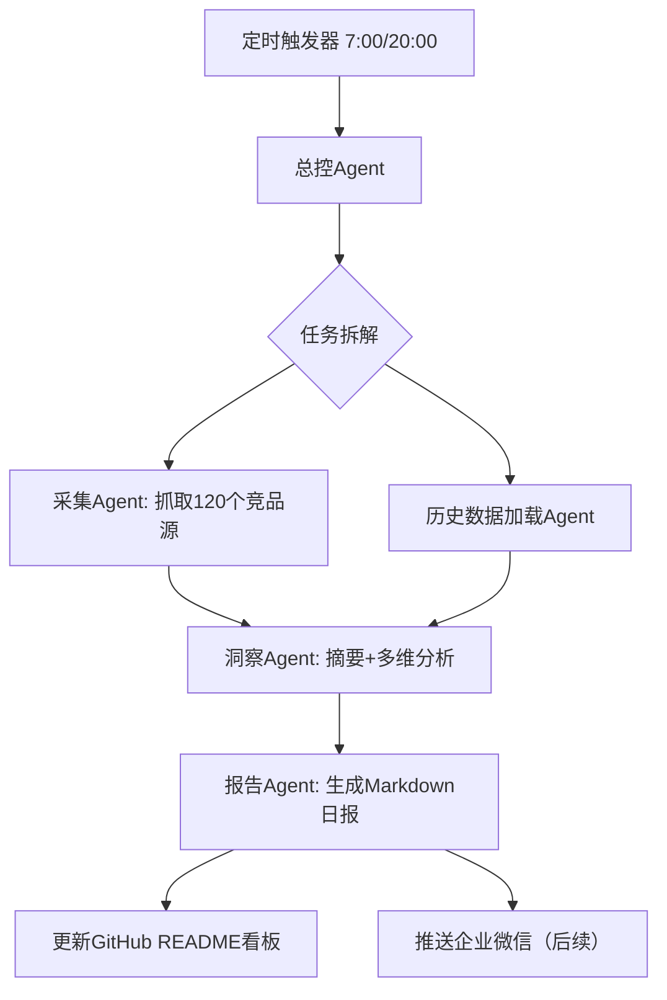

# AI-Powered-CI-Dashboard
An AI-driven competitive intelligence dashboard using MiMo model and multi-agent framework.

## 技术架构

本项目采用多 Agent 协同设计，工作流程如下：

```mermaid
graph TD
    A[定时触发器 7:00/20:00] --> B[总控Agent]
    B --> C{任务拆解}
    C --> D[采集Agent: 抓取120个竞品源]
    C --> E[历史数据加载Agent]
    D --> F[洞察Agent: 摘要+多维分析]
    E --> F
    F --> G[报告Agent: 生成Markdown日报]
    G --> H[更新GitHub README看板]
    G --> I[推送企业微信（后续）]
```
